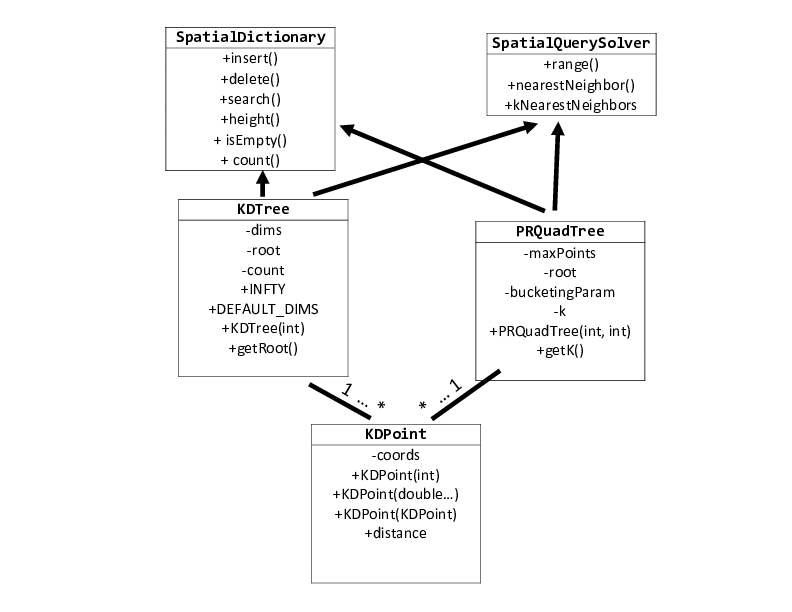
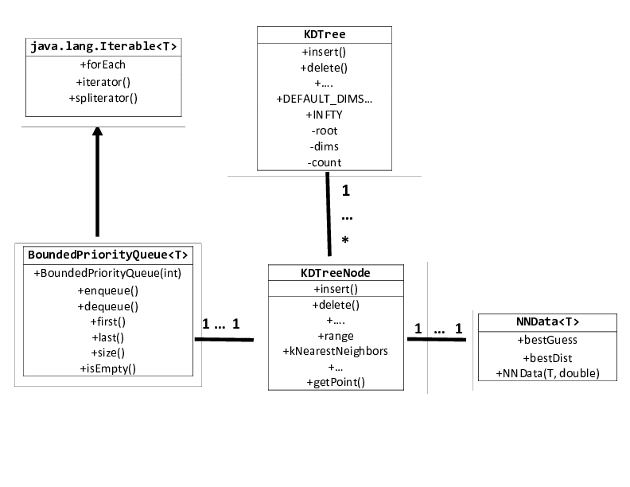

# KD-Trees and PR-QuadTrees

## Overview

In this project you will implement **KD-Trees** and **P-R (Point-Region) QuadTrees**.
You will have to implement **both** dictionary and spatial query functionality. You
will be tested against unit tests hosted on the department's submit server.

Half of this project is the study of spatial data structures and half the practice of
Object-Oriented Programming primitives, in particular, *Inheritance* and *Polymorphism*.
You will need to spend some time studying the provided documentation and code structure,
in order to understand how the various components are pieced together.

## What you need to implement

Everything you need to get started is included in this Git repository. You will need
to fill in the implementation of the following 4 classes:

 * `spatial.knnutils.BoundedPriorityQueue`
 * `spatial.nodes.KDTreeNode`
 * `spatial.nodes.PRQuadBlackNode`
 * `spatial.nodes.PRQuadGrayNode`
 
The classes come with documentation in the `doc` directory, so that you can see the full
functionality exposed by the classes' `public` interfaces. You are given the skeletons of
the above classes, as well as various other classes and interfaces, further described in
the following section.

## Code base

### Top level

This project can essentially be divided into two "mini-projects". It doesn't matter
which you implement first and which you implement second, so we will just *arbitrarily*
decide to call the **KD-Tree** part of the project the **first** part, and the **PR-QuadTree**
par of the project the **second** part.

In this project, we supply you with a lot of code to use to build your own. The following
figure provides a bird's eye view of the project:

In the above figure, arrows denote an "is-a" relation, while regular lines denote a "has-a"
relation.

Both KD-Trees and PR-QuadTrees are **multi-dimensional indices**. Since they are multi-dimensional
indices, the first thing they need to know is the **nature of the keys that they will store**.
The type of key stored is defined by the class `spatial.kdpoint.KDPpoint`. Since, in theory, a point
can have any real number in its dimensions, the inner representation of `KDPoint` will be an
array of `BigDecimal` instances. A `BigDecimal` is essentially an extremely precise `double` which
can be safely compared to another (with `equals()` and `compareTo()`) without the problems
that arise from comparing two primitive `double`s.

Instances of `KDPoint` will appear in virtually **all of the methods** that you will
have to implement! You should study `KDPoint` *extensively* to understand how it works.
In particular, notice that, **since the internal buffer of `KDPoint` is exposed to
the outside world for convenience, a `KDPoint` is a mutable object!** This means that
you should **always** make **deep copies** of `KDPoint` instances when you have to!
**No aliasing!** A copy constructor for `KDPoint` is provided for you. You should also
have a look at how extensive the testing suite for `KDPoint` is, despite the apparent
"simplicity" of the class. You might get some ideas for testing your own classes
by looking at `KDPointTests.java`.

### KD-Tree and Bounded Priority Queue

The following figure show the structure of the first part of the project:

This figure shows the KD-Tree classes and "plug-ins" that allow for spatial queries.
We provide the implementation of `KDTree` for you, but note that all the work has been pushed to
the `KDTreeNode` class (under `nodes`), which you will have to implement. The next section
should clarify why the code is structured in this way.

`KDTreeNode` uses `BoundedPriorityQueue` *only* for the implementation of $`m`$-nearest neighbor queries
with $`m\geq 2`$. For 1-nearest neighbor, it uses the simple `struct`-like class `NNData`. These
types are declared as parameters of the relevant methods of the classes `KDTree` **and**
`KDTreeNode`, so your project **won't compile** against our tests if you don't have them
**exactly where they are in the code tree!**

For your implementation of `BoundedPriorityQueue`, you are given **complete implementational freedom**.
That is, if you wanted to use your own Priority Queue and adjust it to the semantics of
a priority queue bounded above, you can do this. If you want to extend Java's built-in Priority
Queue to do what you want it to do, that is **also** fine with us. You do not even have to
adhere to a **particular implementation** of a Priority Queue: you can use a min-heap,
an array of lists made up of elements having the same priority, sorted by insertion order,
or anything else, as long as the implementation is **correct** and provides **elementary**
efficiency for `first()`, `dequeue()`, `enqueue()`, and `last()`. By "elementary efficiency" we essentially
mean: *Don't make it so bad that the submit server will hang.* Doing this would be a *major
achievement* in its own right, and we trust that we don't need to define it any further.
However, the semantics of `BoundedPriorityQueue` are different from that of a classic Priority
Queue in that it limits the number of "best neighbors" that a given `KDPoint` can have.
Consult the lecture slides for more information on what we mean by that.

### PR-QuadTree

### Goodies

### Important note about implementation of spatial queries

## Hints
